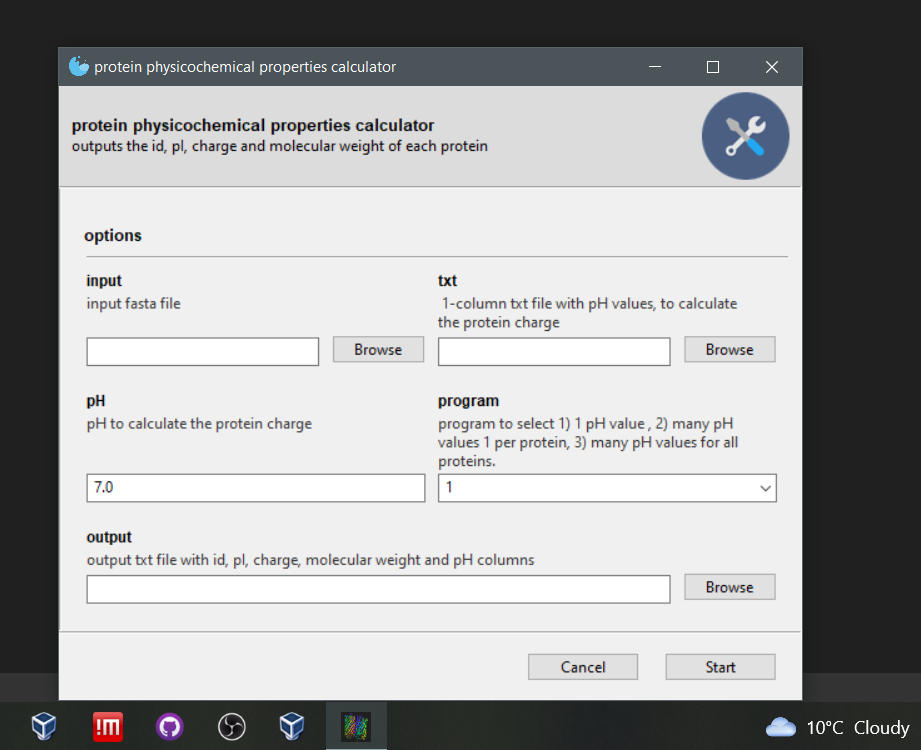

# protein_physicochemical_properties_calculator 
ProtParam based program that outputs the id, pI, charge, molecular weight and pH of each protein

## **GUI stadalone program(.exe)**
Protein physicochemical properties calculator: 

# **Binaries**
The binary files for the linux and windows command line programs are located in (no depedences needed)

## **Function**
The program has 3 options for charge calculation:
1. use 1 pH value for all proteins
2. use 1 pH value different for each protein
3. use many pH values each 1 of them for all proteins

## **Depedences** 
1. python3.8 or later
2. anaconda/miniconda
3. argparse: `pip3 install argparse` (for the command line version of the program)
4. Gooey: `conda install -c conda-forge gooey` (for the GUI version of the program)
5. biopython: `conda install -c conda-forge biopython`
6. pandas: `conda install -c anaconda pandas`

