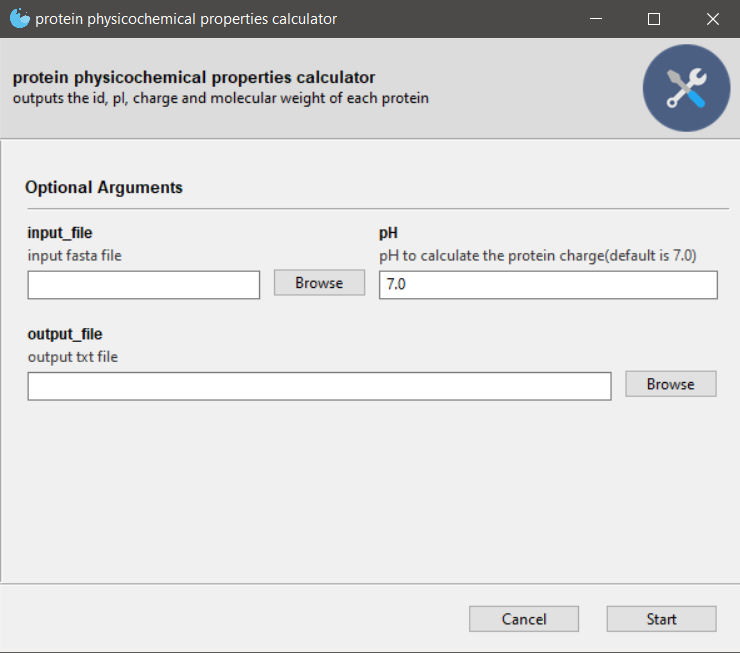

# protein_physicochemical_properties_calculator 
ProtParam based program that outputs the id, pI, charge and molecular weight of each protein

# **depedences:**  
1. python3.8 or later
2. anaconda/miniconda
3. argparse: `pip3 install argparse` (for the command line version of the program)
4. Gooey: `conda install -c conda-forge gooey` (for the GUI version of the program)
5. biopython: `conda install -c conda-forge biopython`
6. pandas: `conda install -c anaconda pandas`
## GUI stadalone program(.exe)
Protein physicochemical properties calculator: 
